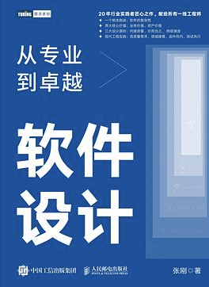
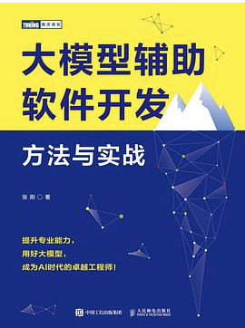

## 欢迎

“共享出行”是一个演示项目，目标在于演示**精益软件设计方法论**、**领域驱动设计（DDD）**和**大模型辅助软件开发**。

本项目以“共享出行”业务为背景，包含了完整的后端、微信小程序用户前端、Keycloak认证服务等。
它由一个真实的在线演示产品（在微信小程序中搜素LeanSD）。

本项目同时也是一个大模型辅助软件开发的实际结果展示（超过80%的代码由大模型在人类提示下完成）

本项目由张刚创建，也得到了许多[贡献者](#contributors)的参与和支持。

### 谁适合了解本项目

如果你对现代软件设计方法论感兴趣，例如：

* 精益需求分析
* 实例化需求
* 领域驱动设计
* 测试先行和测试驱动开发
* 由外而内

或者，如果你是一名大学生，或者软件工程领域的初学者，还没有见到过非常完整的工程项目，包括：

* 从一个创意开始，到需求分析、架构设计、实现和上线的完整过程
* 前后端全栈式开发
* 使用持续集成、容器、Kubernetes、Keycloak等

那么，本项目的开发过程和代码库可能会对你有所帮助。

### 我可以免费使用本项目学习、研究或者开展商业活动吗？

本项目（LeanSD下的所有项目）采用双许可策略。大多数情况下，你都可以使用开源许可。

- **开源许可**：项目在 [Affero GPL](https://www.gnu.org/licenses/agpl-3.0.en.html) 下可供免费使用。这允许个人和组织免费使用、修改和分发本项目，但必须保留原许可证声明。开源许可的适用范围包括：普通开发者、高校学生和教师、以个人名义从事软件工程教育和培训的讲师等。

- **商业许可**：如果您希望基于本项目提供的框架和代码开展商业业务活动，您应该申请商业许可。更多关于商业许可的信息，请查阅 [商业许可说明][LICENSE-COMMERCIAL](https://gitee.com/leansd/overall/blob/main/LICENSE-COMMERCIAL.md)。

### 有什么其他资料分享吗？

关于这个主题，我写了两本书。其中第一本书是关于方法论的阐述，第二本书是关于本案例的创作过程。
其中，第二本书也包括了如何使用大语言模型进行辅助编码的说明。

|         |         |
|:----------------------:|:----------------------:|
|         软件设计：从专业到卓越 [京东](https://item.jd.com/13239249.html) [豆瓣](https://book.douban.com/subject/35966115/)       |         大模型辅助软件开发：方法与实战 [京东](https://item.jd.com/14255955.html) [豆瓣](https://book.douban.com/subject/37010014/)       |

### 贡献者列表
{#contributors}
* 张刚  (gangz@emergentdesign.cn)
* 雷晓宝（lxbzmy@gmail.com）
* 李建 
* 石雄
* 从波
